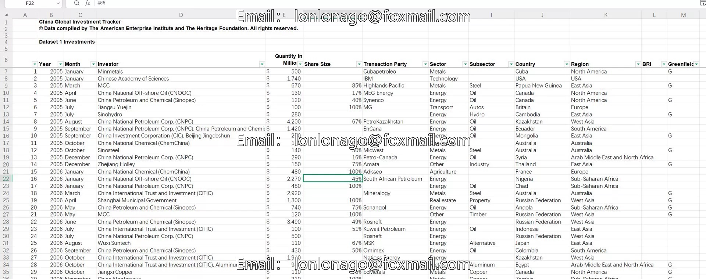
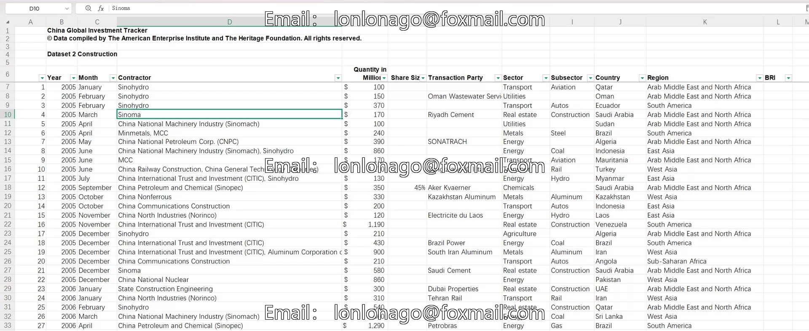
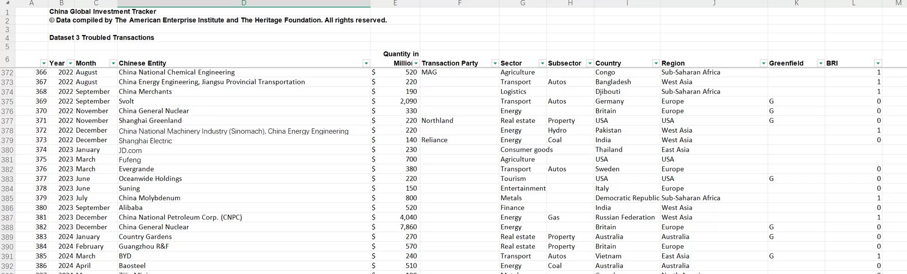
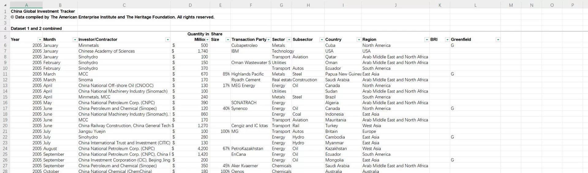

## Body

CGIT: China Global Investment Tracking Data (2005—2024.7)

I. Data Introduction
Data Name: CGIT: China Global Investment Tracking Data
Time Range: 2005—2024.7
Data Scope: Major countries and regions around the world
Data Format: Excel

II. Data Indicators and Details as Shown in the Figure
This data records the foreign investment behavior of Chinese enterprises worldwide, with detailed and clear classifications.
Indicators include: Year Month Investor/Contractor Quantity in Millions Share Size Transaction Party Sector Subsector Country Region BRI Greenfield
Data Structure: Four sub-tables (Excel tabs):
1. Dataset 1: Investments
2. Dataset 2: Construction
3. Dataset 3: Troubled Transactions
4. Dataset 4: Merged Data (Dataset 1 + 2)

## Images

item_972477480278

Here is a pay link on Stripe ( https://buy.stripe.com/3cs8yP7sY87d0vu9AB ). Please contact me lonlonago@foxmail.com after funding $89, and I will send you a complete data files , thank you!

